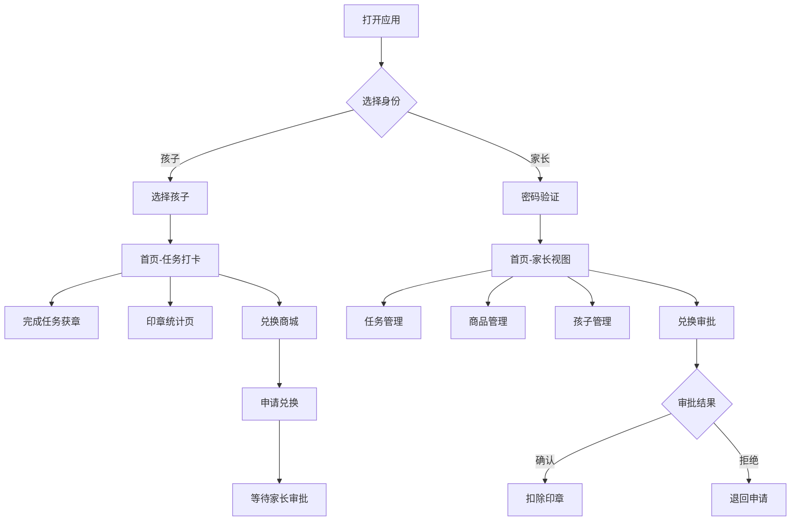

# 小学生习惯养成打卡小程序 - 产品需求文档（PRD）

---

## 1. 产品概述

一款专为 6-12 岁小学生设计的习惯养成打卡应用，通过游戏化的印章奖励机制激励孩子完成日常任务。孩子完成任务获得印章，累计印章可在兑换商城换取心仪奖励，培养自律习惯和成就感。家长可通过独立的管理后台设置任务、商品，并审批孩子的兑换申请。

**核心价值**：将枯燥的习惯养成转化为有趣的游戏体验，建立"努力-奖励"的正向循环，同时赋予家长便捷的管理能力。

---

## 2. 核心功能

### 2.1 用户角色

| 角色 | 进入方式 | 核心权限 |
|------|---------|---------|
| 孩子 | 角色选择页选择孩子身份 | 查看任务、完成任务打卡、申请兑换商品、查看印章统计 |
| 家长 | 角色选择页选择家长身份 + 密码验证 | 管理任务、管理商品、管理孩子信息、审批兑换申请、查看所有数据 |

### 2.2 功能模块

1. **角色选择与登录**：首次进入选择身份，孩子直接登录，家长需密码验证
2. **任务打卡**：展示今日任务列表，点击完成打卡，获得印章奖励
3. **印章系统**：展示当前/累计/已兑换印章数，本周获章统计图表
4. **兑换商城**：商品分类浏览，申请兑换，等待家长审批
5. **个人中心**：主题切换、角色切换、账号设置
6. **家长管理后台**：任务管理、商品管理、孩子管理、兑换审批、兑换记录

### 2.3 页面详情

| 页面名称 | 模块名称 | 功能描述 |
|---------|---------|---------|
| 角色选择页 | 身份选择 | 选择孩子/家长模式；孩子模式下展示已添加的孩子列表供选择；自动记住上次登录状态 |
| 首页 | 任务打卡 | 展示今日任务卡片列表；点击卡片完成打卡并播放获章动画；顶部显示当前印章余额；家长模式显示快捷管理入口 |
| 印章页 | 统计展示 | 展示印章统计卡片（当前/累计/已兑换）；本周获章柱状图；获章历史时间轴 |
| 兑换页 | 商品兑换 | 商品分类标签（全部/玩具/零食/文具）；商品卡片网格展示；点击申请兑换；家长模式显示待审批入口 |
| 个人中心 | 设置管理 | 主题切换（男生蓝色/女生粉色）；角色切换按钮；退出登录；家长模式显示修改密码 |
| 任务管理 | 任务CRUD | 家长端页面；添加/编辑/删除任务；设置任务名称、图标、奖励印章数、描述；启用/禁用开关；每日导入默认任务 |
| 商品管理 | 商品CRUD | 家长端页面；添加/编辑/删除商品；设置名称、图标、价格、分类 |
| 孩子管理 | 孩子CRUD | 家长端页面；添加/编辑/删除孩子；设置姓名、头像、性别、年龄 |
| 兑换确认 | 审批管理 | 家长端页面；查看待确认兑换申请列表；确认兑换（扣除印章）或拒绝；查看历史处理记录 |
| 兑换记录 | 记录查询 | 查看所有兑换记录；按状态筛选（全部/待处理/已完成/已拒绝） |
| 家长登录 | 密码验证 | 密码输入验证；默认密码 123456；支持修改密码 |

---

## 3. 核心流程

### 3.1 孩子打卡流程

孩子打开应用 → 选择"我是小朋友" → 选择自己的名字 → 进入首页看到今日任务 → 点击任务卡片 → 卡片翻转/放大动画 → 显示"已完成"状态 → 印章数量增加 → 播放获章动画（印章飞入钱包）→ 任务进度条更新

### 3.2 兑换申请流程

孩子进入兑换页 → 浏览商品分类 → 点击心仪商品 → 弹出兑换确认弹窗（显示所需印章和当前余额）→ 确认申请 → 状态变为"等待家长确认" → 家长收到待审批提醒 → 家长确认后扣除印章

### 3.3 家长管理流程

家长选择"我是家长" → 输入密码登录 → 进入首页（家长视图）→ 通过快捷入口或底部导航进入管理页面 → 添加/编辑任务或商品 → 查看待审批兑换 → 确认或拒绝申请

---

## 4. 用户界面设计

### 4.1 设计风格

**整体风格**： playful / toy-like（ playful 玩具风格）

- **视觉定位**：温暖、活泼、充满童趣，让孩子感到愉悦和成就感
- **设计原则**：大圆角、柔和阴影、丰富emoji图标、流畅动画反馈
- **空间布局**：卡片式布局，充足留白，信息层级清晰

### 4.2 主题系统

#### 女生主题（默认）

| 元素 | 值 |
|------|-----|
| 主色调 | #FF6B9D（甜心粉） |
| 辅助色 | #FFB8D0（浅粉） |
| 强调色 | #FFD93D（明亮黄） |
| 背景色 | #FFF5F7（极浅粉） |
| 卡片背景 | #FFFFFF（纯白） |
| 文字主色 | #2D3142（深灰） |
| 文字辅助色 | #9CA3AF（中灰） |
| 成功色 | #10B981（翠绿） |
| 危险色 | #EF4444（红色） |

#### 男生主题

| 元素 | 值 |
|------|-----|
| 主色调 | #4A90E2（天空蓝） |
| 辅助色 | #87CEEB（浅蓝） |
| 强调色 | #FFD93D（明亮黄） |
| 背景色 | #F0F7FF（极浅蓝） |
| 卡片背景 | #FFFFFF（纯白） |
| 文字主色 | #2D3142（深灰） |
| 文字辅助色 | #9CA3AF（中灰） |
| 成功色 | #10B981（翠绿） |
| 危险色 | #EF4444（红色） |

### 4.3 字体规范

| 用途 | 大小 | 字重 |
|------|------|------|
| 页面大标题 | 24px | 700 |
| 卡片标题 | 18px | 600 |
| 正文内容 | 14px | 400 |
| 辅助文字/标签 | 12px | 400 |
| 数字强调（印章数） | 32px | 700 |

**字体选择**：
- 中文标题：系统默认字体（优先 PingFang SC / Microsoft YaHei）
- 英文/数字：系统默认字体

### 4.4 组件规范

**任务卡片**：
- 尺寸：自适应宽度，高度 100px
- 圆角：16px
- 阴影：0 2px 8px rgba(0,0,0,0.08)
- 布局：左侧图标区（56px圆形）+ 中间文字区 + 右侧印章数标签
- 状态：未完成（白色背景）/ 已完成（主色调浅背景 + 对勾图标）

**商品卡片**：
- 尺寸：网格布局，每行2列
- 圆角：16px
- 阴影：0 2px 8px rgba(0,0,0,0.08)
- 布局：顶部emoji图标区 + 商品名称 + 所需印章数（带印章图标）

**按钮样式**：
- 主按钮：主色调背景，白色文字，圆角 12px，高度 44px
- 次按钮：白色背景，主色调边框和文字，圆角 12px
- 危险按钮：红色背景，白色文字

**印章标签**：
- 形状：圆角胶囊形
- 背景：主色调 15% 透明度
- 文字：主色调，12px，带小印章emoji前缀

### 4.5 动画规范

| 场景 | 动画效果 | 时长 | 缓动函数 |
|------|---------|------|---------|
| 页面进入 | 淡入 + 轻微上移 | 300ms | ease-out |
| 任务打卡 | 卡片缩放弹跳 + 印章飞入钱包 | 600ms | spring |
| 获章提示 | 底部Toast滑入 | 300ms | ease-out |
| 主题切换 | 全局颜色渐变过渡 | 400ms | ease-in-out |
| 模态框弹出 | 背景淡入 + 内容从底部滑入 | 300ms | ease-out |
| 列表加载 | 卡片依次淡入（stagger 50ms） | 300ms | ease-out |
| 数字变化 | 数字滚动动画 | 500ms | ease-out |

### 4.6 响应式设计

- **设计基准**：移动端优先（375px - 430px 宽度）
- **适配范围**：320px - 768px
- **大屏适配**：平板端（768px+）任务卡片改为每行2列，商品卡片每行3-4列

---

## 5. 数据初始化

### 5.1 默认任务

| 任务名称 | 图标 | 奖励印章 | 描述 |
|---------|------|---------|------|
| 完成作业 | ✏️ | 5 | 认真完成今天的作业 |
| 认真刷牙 | 🪥 | 3 | 早晚刷牙，每次2分钟 |
| 跳绳锻炼 | 🏃 | 4 | 跳绳100下或运动15分钟 |
| 阅读课外书 | 📚 | 5 | 阅读30分钟以上 |
| 考试优秀 | 🌟 | 20 | 考试成绩达到优秀 |
| 帮忙做家务 | 🧹 | 5 | 主动帮助家人做家务 |

### 5.2 默认商品

| 商品名称 | 图标 | 价格（印章） | 分类 |
|---------|------|-------------|------|
| 彩色积木套装 | 🧱 | 80 | 玩具 |
| 彩虹棒棒糖 | 🍭 | 30 | 零食 |
| 儿童故事书 | 📖 | 60 | 文具 |
| 小熊饼干 | 🍪 | 25 | 零食 |
| 玩具汽车 | 🚗 | 100 | 玩具 |
| 草莓冰淇淋 | 🍦 | 40 | 零食 |

### 5.3 默认孩子

系统首次使用时应引导家长添加至少一个孩子，不提供默认孩子数据。

---

## 6. 非功能需求

### 6.1 性能要求

- 首屏加载时间 < 2秒
- 页面切换动画流畅，目标 60fps
- 数据操作（增删改查）响应时间 < 300ms

### 6.2 兼容性

- 支持 Chrome 90+、Safari 14+、Edge 90+
- 支持 iOS Safari 和 Android Chrome
- 支持 PWA 模式（可添加到主屏幕）

### 6.3 安全要求

- 家长密码使用 bcrypt 或 SHA-256 加密存储
- 所有数据按 childId 隔离，防止数据串扰
- 演示模式下数据仅存储在本地，不上传服务器

### 6.4 可访问性

- 按钮和可点击区域最小 44x44px
- 支持键盘操作（Tab 导航、Enter 确认）
- 适当的 ARIA 标签
- 颜色对比度符合 WCAG AA 标准

---

## 7. 演示模式

- 项目默认开启演示模式（`isDemoMode: true`）
- 演示模式下所有数据存储在 localStorage，按 childId 隔离
- 无需后端服务即可完整体验所有功能
- 通过环境变量或配置开关可切换为真实后端模式
