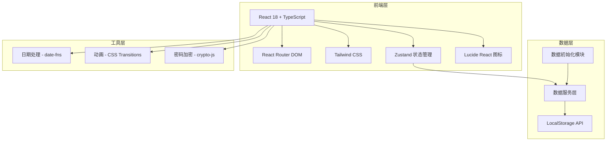
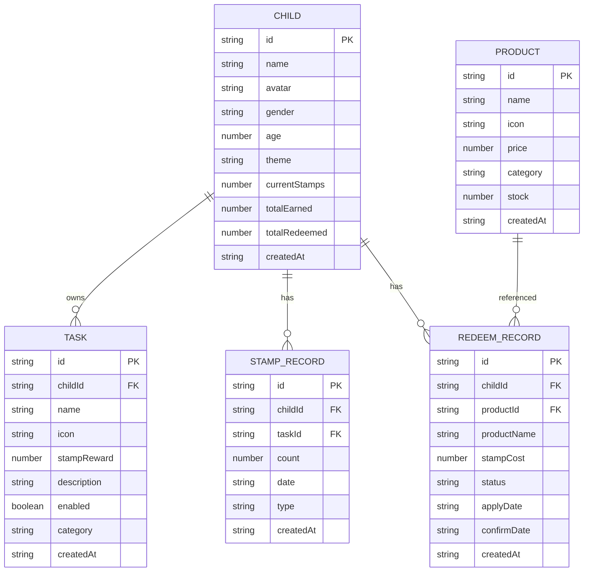

# 小学生习惯养成打卡小程序 - 技术架构文档

---

## 1. 架构设计



---

## 2. 技术选型

| 层级 | 技术 | 版本 | 说明 |
|------|------|------|------|
| 前端框架 | React | 18.x | 组件化UI开发 |
| 语言 | TypeScript | 5.x | 类型安全 |
| 构建工具 | Vite | 5.x | 快速开发构建 |
| 样式方案 | Tailwind CSS | 3.x | 原子化CSS |
| 状态管理 | Zustand | 4.x | 轻量级状态管理 |
| 路由 | React Router DOM | 6.x | 单页应用路由 |
| 图标 | Lucide React | 最新 | 统一图标库 |
| 日期处理 | date-fns | 3.x | 日期格式化与计算 |
| 密码加密 | crypto-js | 4.x | SHA-256加密 |
| 数据持久化 | LocalStorage | 原生 | 演示模式数据存储 |

---

## 3. 路由定义

| 路由路径 | 页面名称 | 权限 | 说明 |
|---------|---------|------|------|
| / | 角色选择页 | 公开 | 首次进入，选择孩子/家长身份 |
| /home | 首页 | 孩子/家长 | 任务打卡或家长管理入口 |
| /stamps | 印章页 | 孩子/家长 | 印章统计与历史 |
| /redeem | 兑换页 | 孩子/家长 | 商品浏览与兑换 |
| /profile | 个人中心 | 孩子/家长 | 设置与主题切换 |
| /parent-login | 家长登录 | 公开 | 密码验证进入家长模式 |
| /task-manage | 任务管理 | 家长 | 任务的增删改查 |
| /product-manage | 商品管理 | 家长 | 商品的增删改查 |
| /child-manage | 孩子管理 | 家长 | 孩子的增删改查 |
| /confirm-redeem | 兑换审批 | 家长 | 兑换申请的确认/拒绝 |
| /redeem-records | 兑换记录 | 家长 | 所有兑换记录查询 |

---

## 4. 数据模型

### 4.1 ER 图



### 4.2 数据类型定义

```typescript
// 孩子
interface Child {
  id: string;
  name: string;
  avatar: string;        // emoji 或头像URL
  gender: 'boy' | 'girl';
  age: number;
  theme: 'boy' | 'girl';
  currentStamps: number;
  totalEarned: number;
  totalRedeemed: number;
  createdAt: string;
}

// 任务
interface Task {
  id: string;
  childId: string;
  name: string;
  icon: string;          // emoji
  stampReward: number;
  description: string;
  enabled: boolean;
  category: string;
  createdAt: string;
}

// 商品
interface Product {
  id: string;
  name: string;
  icon: string;          // emoji
  price: number;
  category: 'toy' | 'snack' | 'stationery' | 'other';
  stock: number;
  createdAt: string;
}

// 印章记录
interface StampRecord {
  id: string;
  childId: string;
  taskId: string;
  taskName: string;
  count: number;
  date: string;          // YYYY-MM-DD
  type: 'earn' | 'redeem' | 'adjust';
  createdAt: string;
}

// 兑换记录
interface RedeemRecord {
  id: string;
  childId: string;
  productId: string;
  productName: string;
  stampCost: number;
  status: 'pending' | 'approved' | 'rejected';
  applyDate: string;
  confirmDate?: string;
  createdAt: string;
}

// 应用状态
interface AppState {
  userRole: 'child' | 'parent' | null;
  selectedChildId: string | null;
  theme: 'boy' | 'girl';
  isAuthenticated: boolean;
}
```

### 4.3 LocalStorage 存储键

| 存储键 | 数据类型 | 说明 |
|--------|---------|------|
| `childList` | Child[] | 所有孩子列表 |
| `selectedChildId` | string | 当前选中孩子ID |
| `demo_tasks_{childId}` | Task[] | 每个孩子的任务列表 |
| `demo_stamp_records_{childId}` | StampRecord[] | 每个孩子的印章记录 |
| `demo_redeem_{childId}` | RedeemRecord[] | 每个孩子的兑换记录 |
| `managed_products` | Product[] | 家长管理的商品列表 |
| `userRole` | 'child' \| 'parent' | 当前用户角色 |
| `theme` | 'boy' \| 'girl' | 当前主题 |
| `parentPassword` | string | 加密后的家长密码 |

---

## 5. 项目结构

```
d:\project\clock\
├── .trae\documents\          # 项目文档
│   ├── PRD.md                # 产品需求文档
│   └── Tech-Architecture.md  # 技术架构文档
├── public\                    # 静态资源
├── src\
│   ├── components\            # 公共组件
│   │   ├── Navbar.tsx        # 顶部导航栏
│   │   ├── TabBar.tsx        # 底部标签栏
│   │   ├── TaskCard.tsx      # 任务卡片
│   │   ├── ProductCard.tsx   # 商品卡片
│   │   ├── StampBadge.tsx    # 印章标签
│   │   ├── Modal.tsx         # 通用弹窗
│   │   ├── Toast.tsx         # 提示消息
│   │   ├── EmptyState.tsx    # 空状态
│   │   └── ThemeProvider.tsx # 主题提供者
│   ├── pages\                 # 页面组件
│   │   ├── RoleSelect.tsx    # 角色选择页
│   │   ├── Home.tsx          # 首页
│   │   ├── Stamps.tsx        # 印章页
│   │   ├── Redeem.tsx        # 兑换页
│   │   ├── Profile.tsx       # 个人中心
│   │   ├── ParentLogin.tsx   # 家长登录
│   │   ├── TaskManage.tsx    # 任务管理
│   │   ├── ProductManage.tsx # 商品管理
│   │   ├── ChildManage.tsx   # 孩子管理
│   │   ├── ConfirmRedeem.tsx # 兑换审批
│   │   └── RedeemRecords.tsx # 兑换记录
│   ├── hooks\                 # 自定义Hooks
│   │   ├── useTheme.ts       # 主题管理
│   │   ├── useAuth.ts        # 认证管理
│   │   ├── useLocalStorage.ts # localStorage封装
│   │   └── useChildData.ts   # 孩子数据管理
│   ├── stores\                # Zustand状态管理
│   │   ├── appStore.ts       # 应用全局状态
│   │   ├── childStore.ts     # 孩子数据状态
│   │   ├── taskStore.ts      # 任务数据状态
│   │   ├── productStore.ts   # 商品数据状态
│   │   └── stampStore.ts     # 印章数据状态
│   ├── utils\                 # 工具函数
│   │   ├── storage.ts        # 数据持久化封装
│   │   ├── crypto.ts         # 密码加密
│   │   ├── date.ts           # 日期处理
│   │   └── constants.ts      # 常量定义
│   ├── types\                 # TypeScript类型
│   │   └── index.ts          # 所有类型定义
│   ├── App.tsx               # 根组件
│   ├── main.tsx              # 入口文件
│   └── index.css             # 全局样式
├── index.html                # HTML模板
├── package.json              # 依赖配置
├── tsconfig.json             # TypeScript配置
├── vite.config.ts            # Vite配置
├── tailwind.config.js        # Tailwind配置
└── postcss.config.js         # PostCSS配置
```

---

## 6. 状态管理设计

### 6.1 应用状态 (appStore)

```typescript
interface AppState {
  userRole: 'child' | 'parent' | null;
  selectedChildId: string | null;
  theme: 'boy' | 'girl';
  isAuthenticated: boolean;
  parentPassword: string;
  
  setUserRole: (role: 'child' | 'parent') => void;
  setSelectedChild: (childId: string) => void;
  setTheme: (theme: 'boy' | 'girl') => void;
  loginAsParent: (password: string) => boolean;
  logout: () => void;
}
```

### 6.2 孩子状态 (childStore)

```typescript
interface ChildState {
  children: Child[];
  currentChild: Child | null;
  
  addChild: (child: Omit<Child, 'id' | 'createdAt'>) => void;
  updateChild: (id: string, data: Partial<Child>) => void;
  deleteChild: (id: string) => void;
  selectChild: (id: string) => void;
  updateStamps: (childId: string, delta: number) => void;
}
```

### 6.3 任务状态 (taskStore)

```typescript
interface TaskState {
  tasks: Task[];
  
  loadTasks: (childId: string) => void;
  addTask: (task: Omit<Task, 'id' | 'createdAt'>) => void;
  updateTask: (id: string, data: Partial<Task>) => void;
  deleteTask: (id: string) => void;
  toggleTask: (id: string) => void;
  completeTask: (taskId: string, childId: string) => number; // 返回获得的印章数
  importDefaultTasks: (childId: string) => void;
}
```

### 6.4 商品状态 (productStore)

```typescript
interface ProductState {
  products: Product[];
  
  loadProducts: () => void;
  addProduct: (product: Omit<Product, 'id' | 'createdAt'>) => void;
  updateProduct: (id: string, data: Partial<Product>) => void;
  deleteProduct: (id: string) => void;
}
```

### 6.5 印章状态 (stampStore)

```typescript
interface StampState {
  stampRecords: StampRecord[];
  redeemRecords: RedeemRecord[];
  
  loadRecords: (childId: string) => void;
  addStamp: (childId: string, taskId: string, taskName: string, count: number) => void;
  applyRedeem: (childId: string, product: Product) => void;
  confirmRedeem: (recordId: string, approved: boolean) => void;
  getWeeklyStats: (childId: string) => { date: string; count: number }[];
  getPendingRedeems: () => RedeemRecord[];
}
```

---

## 7. 核心逻辑设计

### 7.1 主题切换机制

- 使用 CSS 变量定义主题色，存储在 `:root` 和 `[data-theme="boy"]` / `[data-theme="girl"]` 下
- 切换主题时更新 `data-theme` 属性，CSS 变量自动过渡
- 主题偏好持久化到 localStorage

### 7.2 数据隔离机制

- 所有与孩子相关的数据按 `childId` 隔离存储
- 键名格式：`demo_{dataType}_{childId}`
- 切换孩子时重新加载对应数据

### 7.3 每日任务重置

- 任务完成状态不持久化，每次加载时默认全部未完成
- 通过 `StampRecord` 查询今日已完成的任务，标记为已完成
- 实现"每日新鲜开始"的体验

### 7.4 密码安全

- 默认密码 `123456` 使用 SHA-256 哈希存储
- 修改密码时重新哈希并存储
- 登录时比对哈希值

---

## 8. 开发规范

### 8.1 组件规范

- 每个组件文件不超过 300 行
- 组件职责单一，复杂页面拆分为子组件
- 使用 TypeScript 类型约束 Props
- 优先使用函数组件 + Hooks

### 8.2 命名规范

- 组件名：PascalCase（如 `TaskCard.tsx`）
- Hooks：camelCase，以 `use` 开头（如 `useTheme.ts`）
- Store：camelCase，以 `Store` 结尾（如 `appStore.ts`）
- 工具函数：camelCase（如 `formatDate.ts`）
- 类型/接口：PascalCase（如 `StampRecord`）

### 8.3 样式规范

- 使用 Tailwind CSS 原子类
- 主题色通过 CSS 变量引用，不硬编码
- 动画优先使用 CSS transitions，复杂动画使用 CSS keyframes
- 响应式断点：sm(640px)、md(768px)、lg(1024px)

---

## 9. 演示模式配置

```typescript
// src/utils/constants.ts
export const IS_DEMO_MODE = true;

export const DEFAULT_PARENT_PASSWORD = '123456';

export const DEFAULT_TASKS = [
  { name: '完成作业', icon: '✏️', stampReward: 5, description: '认真完成今天的作业', category: '学习' },
  { name: '认真刷牙', icon: '🪥', stampReward: 3, description: '早晚刷牙，每次2分钟', category: '生活' },
  { name: '跳绳锻炼', icon: '🏃', stampReward: 4, description: '跳绳100下或运动15分钟', category: '运动' },
  { name: '阅读课外书', icon: '📚', stampReward: 5, description: '阅读30分钟以上', category: '学习' },
  { name: '考试优秀', icon: '🌟', stampReward: 20, description: '考试成绩达到优秀', category: '学习' },
  { name: '帮忙做家务', icon: '🧹', stampReward: 5, description: '主动帮助家人做家务', category: '生活' },
];

export const DEFAULT_PRODUCTS = [
  { name: '彩色积木套装', icon: '🧱', price: 80, category: 'toy', stock: 999 },
  { name: '彩虹棒棒糖', icon: '🍭', price: 30, category: 'snack', stock: 999 },
  { name: '儿童故事书', icon: '📖', price: 60, category: 'stationery', stock: 999 },
  { name: '小熊饼干', icon: '🍪', price: 25, category: 'snack', stock: 999 },
  { name: '玩具汽车', icon: '🚗', price: 100, category: 'toy', stock: 999 },
  { name: '草莓冰淇淋', icon: '🍦', price: 40, category: 'snack', stock: 999 },
];
```

---

## 10. 构建与部署

### 10.1 开发命令

```bash
# 安装依赖
npm install

# 启动开发服务器
npm run dev

# 构建生产版本
npm run build

# 预览生产构建
npm run preview

# TypeScript 类型检查
npm run typecheck
```

### 10.2 部署

- 构建输出目录：`dist/`
- 支持静态托管（GitHub Pages、Vercel、Netlify 等）
- 无需后端服务器，纯前端部署
